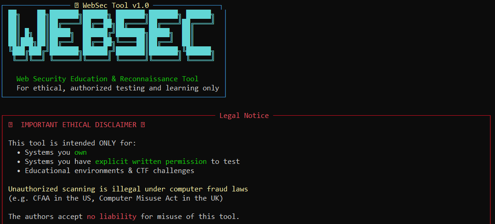

# WebSec Tool v1.0



> A Python-based web security education and ethical reconnaissance tool for authorized testing and learning.

---

## Legal Disclaimer

This tool is intended **ONLY** for:
- Systems you **own**
- Systems you have **explicit written permission** to test
- Educational environments & CTF challenges

Unauthorized scanning is illegal under computer fraud laws (e.g. CFAA in the US, Computer Misuse Act in the UK). The authors accept **no liability** for misuse of this tool.

---

## Features

### 1. Vulnerability Scanner
Check a target URL for OWASP Top 10 issues including:

| Check | Description |
|-------|-------------|
| Security Headers | CSP, HSTS, X-Frame-Options, X-Content-Type-Options, Referrer-Policy, etc. |
| Reflected XSS | Injects a probe into query params and checks for echo in response |
| SQL Injection Hints | Passively scans response for database error strings |
| CSRF | Analyzes all `<form>` tags for CSRF token presence |
| Clickjacking | Checks for X-Frame-Options or CSP `frame-ancestors` directive |
| Open Redirect | Tests 7 common redirect params (redirect, url, next, return, goto...) |
| Sensitive File Exposure | Probes 18 common paths (`.env`, `wp-config.php`, `/.git/config`, etc.) |
| Server Fingerprint | Extracts `Server` and `X-Powered-By` header values |

### 2. Security News Feed
- Fetches Hacker News top 100 stories via the official Firebase API
- Filters for security keywords: `CVE`, `exploit`, `breach`, `XSS`, `ransomware`, `vulnerability`, and more
- Displays results in a rich table with score, comment count, and source link

### 3. CVE Database Browser
- Queries the [NVD API](https://services.nvd.nist.gov/rest/json/cves/2.0) for CVEs by vulnerability type
- 7 preset categories + custom keyword search:
  - XSS (Cross-Site Scripting)
  - SQL Injection
  - Remote Code Execution
  - CSRF
  - Buffer Overflow
  - Path Traversal
  - SSRF (Server-Side Request Forgery)
- Displays CVSS score, severity (color-coded), publication date, and description

---

## Installation

**Requirements:** Python 3.8+

```bash
# Clone or download the script
git clone https://github.com/yourname/websec-tool.git
cd websec-tool

# Install dependencies
pip install requests rich beautifulsoup4
```

---

## Usage

```bash
python3 websec_tool.py
```

You will be shown an ethical disclaimer and asked to confirm before any scanning begins. Then you'll be presented with an interactive menu:

```
1. Vulnerability Scanner
2. Security News Feed
3. CVE Database Browser
4. Exit
```

### Example — Scanning a target

```
Enter target URL: https://your-own-site.com
Confirm you own or have permission to scan? [y/n]: y

Scanning https://your-own-site.com...

  Security Headers  ──────────────────────────
  ✗ MISSING  Content-Security-Policy   Prevents XSS and data injection
  ✓ PRESENT  X-Frame-Options           SAMEORIGIN
  ...
```

---

## Dependencies

| Package | Purpose |
|---------|---------|
| `requests` | HTTP requests to target and APIs |
| `rich` | Colored CLI output, tables, panels, spinners |
| `beautifulsoup4` | HTML parsing for CSRF and form analysis |

---

## Project Structure

```
websec-tool/
├── websec_tool.py      # Main script (all features)
└── README.md           # This file
```

---

## Data Sources

- **Hacker News API** — https://hacker-news.firebaseio.com/v0/
- **NVD CVE API** — https://services.nvd.nist.gov/rest/json/cves/2.0
- **OWASP Top 10** — https://owasp.org/www-project-top-ten/

---

## Contributing

Pull requests welcome. Please ensure all contributions maintain the ethical-use-only philosophy of this project. Do not add features that bypass consent checks or enable automated mass scanning.

---

## License

MIT License — see `LICENSE` for details.
